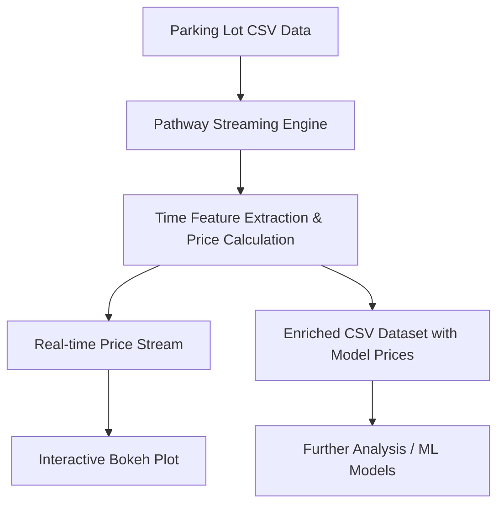

# Dynamic Pricing for Urban Parking Lots using Pathway

## 📖 Introduction

This project presents a real-time **Dynamic Pricing System for Urban Parking Lots** utilizing **Pathway's streaming framework** combined with **Bokeh interactive visualizations**. It simulates live parking data streams from multiple parking locations, computes dynamic parking prices based on real-time occupancy levels, and visualizes these prices through interactive dashboards.

The solution extends beyond a simple pricing model by incorporating spatial awareness of **neighboring parking lots** to refine pricing strategies, thereby enhancing urban parking management and providing a foundation for intelligent decision-making.

---

## 💡 Key Features

- ⏱️ Real-time streaming of parking occupancy data using **Pathway**.
- 📊 Dynamic pricing calculation based on live occupancy and capacity.
- 📈 Interactive time-series visualization of parking prices using **Bokeh**.
- 🌐 Competitive analysis through geographic proximity of neighboring parking lots.
- 📃 Enrichment of datasets with model-generated prices for comparative studies.

---
## 🏗 Architecture Diagram



---

## 🔄 Project Architecture & Workflow

1. **Data Preparation:**
   - CSV files for each parking lot containing `Timestamp`, `Occupancy`, and `Capacity`.

2. **Streaming Setup:**
   - Use Pathway's `replay_csv` to simulate real-time data streams for each parking lot.

3. **Time Feature Engineering:**
   - Extract datetime and day-level information for temporal grouping.

4. **Dynamic Price Calculation:**
   - Apply baseline pricing model: `price = 10 + (Occupancy / Capacity)`.
   - Optionally, factor in competitor prices and traffic/vehicle weightings.

5. **Visualization:**
   - Display real-time price trends using **Bokeh** in a **Panel** dashboard.

6. **Competitor Analysis:**
   - Identify neighboring parking lots within a 1km radius and compute average competitor pricing and occupancy.

7. **Enriched Dataset:**
   - Save enhanced datasets with generated prices for each timestamp.

8. **Optional:**
   - Further model development for advanced pricing using ML, traffic, and event-based factors.

---
## 🗂 Project Structure

```
/Dynamic-Parking-Pricing
│
├── README.md
├── requirements.txt
├── .gitignore
│
├── notebooks/
│   └── parking_pricing_final.ipynb
│
├── data/
│   ├── lot_Lot1.csv
│   └── lot_Lot2.csv
│
├── visuals/
│   └── example_plot.png
```

---

## ⚙️ Installation Instructions

1. **Clone this repository:**
```bash
git clone https://github.com/vermaapurva33/Capstone-Project.git
cd Capstone-Project
```

2. **Install required dependencies:**
```bash
pip install -r requirements.txt
```

3. **Alternatively open the notebook directly in Google Colab:**

[](https://colab.research.google.com/drive/1aRJvoFSmb1ybCk5BkEvR9OuLa_fhJmoc?usp=sharing)

---

## 📅 How to Use

1. Ensure your `/data/` folder contains the parking lot CSV files with the following columns:
```
Timestamp,Occupancy,Capacity
```

2. Open and execute the notebook step by step:

- Select a parking lot from the provided list.
- Generate and visualize real-time dynamic prices based on live data.
- Enrich your dataset by calculating and saving model-based prices.
- Visualize price trends using Bokeh plots for each parking lot.

3. Advanced features:
- Explore neighboring parking lot competition analysis.
- Experiment with different pricing models using custom vehicle and traffic weights.

---

## 📊 Sample Visualizations

Visual outputs include real-time streaming line graphs showing:

- Daily dynamic parking prices.
- Competitor parking lot comparisons.
- Occupancy ratio trends over time.


## 🎥 Demo Video

[Click here to watch the demo video](https://drive.google.com/file/d/1dn_2PqVTWyPxcJyBNTFSMVfuSiroWM1V/view?usp=sharing)


[![Watch Demo on YouTube]](https://youtu.be/IqdMxmYXx48)

---

## 🔮 Future Improvements

- Implement more sophisticated demand prediction models (e.g., machine learning).
- Incorporate additional data layers: weather, events, real-time traffic.
- Deploy as a fully interactive web dashboard for public or commercial use.

---

## 👤 Author

- **Your Name**  
- [LinkedIn](https://www.linkedin.com/in/apurva-verma-04aab1318) | [GitHub](https://github.com/vermaapurva33)

---

## 📍 Acknowledgments

- Special thanks to the creators of **Pathway** for the powerful open-source tools.

---
